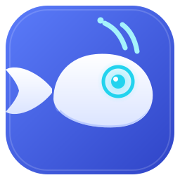
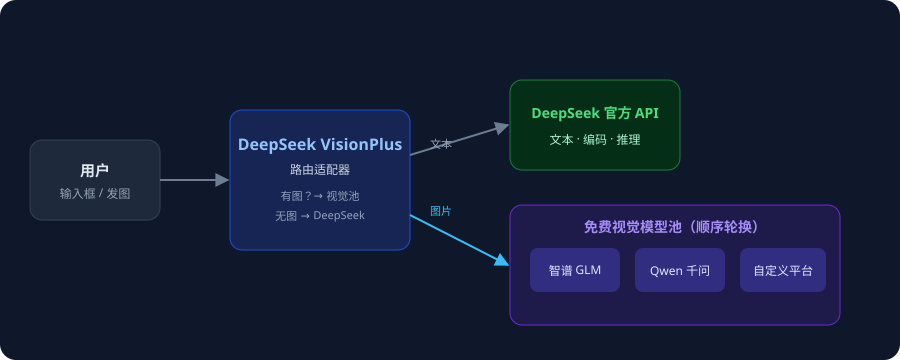

<p align="center">
  
</p>

<h1 align="center">DeepSeek VisionPlus</h1>
<p align="center">
  <a href="https://github.com/qq247505/DeepSeek-VisionPlus/blob/main/LICENSE"></a>
  <a href="https://github.com/qq247505/DeepSeek-VisionPlus"></a>
  
</p>

<p align="center">
  DeepSeek 官方 API 为核心，外接免费视觉模型。<br/>
  文本与编码由 DeepSeek 官方模型处理；视觉任务自动路由到免费视觉模型池（智谱 GLM / SiliconFlow Qwen）。
</p>

## 概述

DeepSeek 官方模型是纯文本模型，本身不能看图。DeepSeek VisionPlus 是一个 DeepSeek Harness 插件：

- **文本侧**：仍走 DeepSeek 官方 API（deepseek-v4-pro / deepseek-v4-flash），推理等级、编码能力原样保留；
- **视觉侧**：当消息中出现图片（输入框选图 / 粘贴 / 模型自主调用 read_image）时，自动把图片交给**免费视觉模型池**处理，再把结果返回给 DeepSeek 继续对话；
- **池子轮换**：多个免费视觉模型按顺序尝试，单个失败自动轮换下一个；全部失败如实抛回 DeepSeek，由其自行决策；
- **免费模型保护**：内置限频（最小间隔 + 每分钟上限 + 失败冷却），不会打爆免费额度。

## 架构



## 特性

- 模型选择器新增 **DeepSeek-V4-Pro 视觉** / **DeepSeek-V4-Flash 视觉** 两个变体（Off/High/Max 推理等级，默认 High，与官方一致）；
- 选中变体后，输入框左侧出现**图片按钮**，选图 / 多选 / 拖拽，发图自动走视觉池；
- 设置 → 模型页内嵌 **DeepSeek VisionPlus** 卡片：添加平台（智谱 / Qwen / 自定义）、配置密钥、模型目录（ID / 名称 / 上下文窗口 / 最大输出，K/M 单位），保存实时生效；
- 每个平台带**测试按钮**：先校验参数（密钥 / 地址 / 模型 ID / 官方上限），再按官方对接方式真实请求（视觉测试会发送测试图），结果气泡提示 3 秒消失；
- 对话中显示友好状态行（正在调用 xx 模型处理图片… / 成功 / 失败原因）。

## 安装

要求：已安装官方 DeepSeek Harness（桌面端或源码运行均可），并已安装 pnpm。

```bash
dsh plugin --profile web add github:qq247505/DeepSeek-VisionPlus
# 或本地目录
dsh plugin --profile web add <本目录路径>
```

安装脚本会自动定位 Harness 源码目录（桌面端安装即自带；也可用 `DSH_HARNESS_ROOT` 环境变量指定），应用增强补丁并重建宿主；找不到仓库或关键补丁无法应用时，安装会**直接失败并输出原因**（插件只有完整形态）。

## 使用

1. 重启 Harness，打开 设置 → 模型，展开 **DeepSeek VisionPlus** 卡片；
2. DeepSeek 块填入 `DEEPSEEK_API_KEY`（API 地址默认官方 `https://api.deepseek.com`），点"测试"验证；
3. 点 "＋ 智谱（GLM）" / "＋ Qwen（千问）" 添加视觉平台，填入对应密钥（`GLM_API_KEY` / `SILICONFLOW_API_KEY`），各点"测试"验证；
4. 保存 → 对话页模型选择器选择 **DeepSeek-V4-Pro 视觉**（或 Flash）；
5. 输入框点图片按钮发图，或让模型自主 read_image —— 视觉任务自动路由。

## 预置平台规格

| 平台 | 模型 | 上下文 | 最大输出 |
|---|---|---|---|
| 智谱 GLM | glm-4.1v-thinking-flash | 64K | 16K |
| 智谱 GLM | glm-4.6v-flash | 128K | 32K |
| SiliconFlow | Qwen/Qwen3-VL-8B-Instruct | 64K | 16K |

> 以上为智谱官方文档模型概览与实测 API 限制的权威值；自定义平台按对方官方文档填写。

## 增强补丁

插件核心功能不需要补丁；安装时 postinstall 自动应用以下增强补丁（需能定位 Harness 源码仓库）：

| 补丁 | 增强内容 |
|---|---|
| models-extra-slot | 设置卡片内嵌到官方"模型"页 |
| vision-test-channel | 测试按钮升级为真实视觉测试 |
| session-switch | 会话级模型切换（不污染全局默认） |
| token-clamp | 会话记账钳制（防负数崩溃） |
| hide-vision-cards | 会话模型选择器隐藏内部线路 |

手动应用：把 `patches\增强补丁.bat` 复制到 Harness 仓库根目录双击执行。

## 常见问题

- **测试失败：密钥无效（401）**：检查平台密钥是否填写正确；
- **测试失败：接口或模型不存在（404）**：检查 API 地址与模型 ID；
- **视觉请求限流（429）**：免费模型频率有限，插件自带限频，稍后重试；
- **想再加平台**：点 "＋ 自定义平台"，按对方官方文档填写。

## License

[MIT](LICENSE)